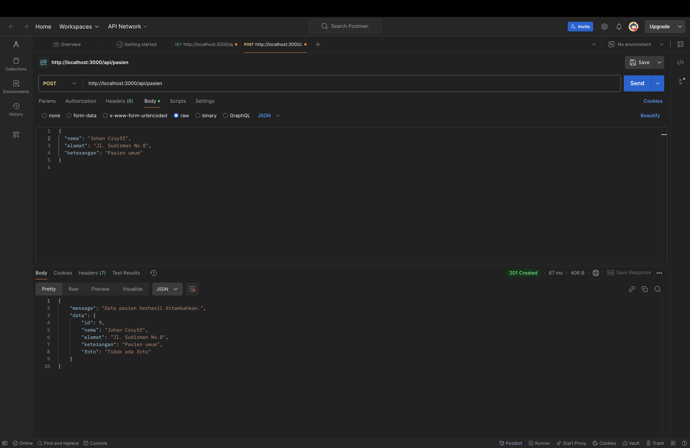

# UCP1_PAWD_157

# Proyek Dokumentasi API - Abdullah Maajid

**Nama**: Abdullah Maajid  
**NIM**: 20220140157  
**Kelas**: D  

## Deskripsi Proyek
Proyek ini berisi dokumentasi tentang implementasi berbagai metode HTTP dalam pengelolaan data melalui API. Gambar-gambar berikut menunjukkan urutan implementasi API yang mencakup metode GET, POST, PUT, dan DELETE, serta struktur database yang digunakan dalam aplikasi.

## Urutan Foto
Berikut adalah urutan foto yang menjelaskan alur dan implementasi API dalam proyek ini:

1. **PAGE1.png**  
   Deskripsi halaman pertama, yang menunjukkan antarmuka awal aplikasi.

   

2. **PAGE2.png**  
   Deskripsi halaman kedua, yang memberikan informasi lebih lanjut tentang aplikasi.

   

3. **DATABASE.png**  
   Struktur database yang digunakan untuk menyimpan data aplikasi.

   

4. **GET.png**  
   Menampilkan implementasi metode GET untuk mengambil data dari server.

   

5. **POST.png**  
   Menampilkan implementasi metode POST untuk menambahkan data ke server.

   

6. **PUT.png**  
   Menampilkan implementasi metode PUT untuk memperbarui data yang ada di server.

   

7. **DELETE.png**  
   Menampilkan implementasi metode DELETE untuk menghapus data dari server.

   

